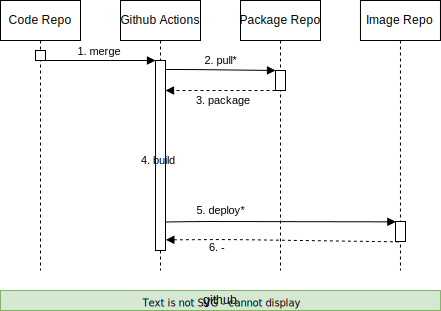

# Concept: Development Operations API

## Context
This file describes the common flows involving development-operations-api.

## Purpose
The goal of operations API is to simplify the provisioning and maintenance of the kubernetes cluster and other services.

## Flows
This section describes the data flows related to common manual, semi-automated and automated devops tasks.

### Deploy NPM Package

Flow of building an NPM package from source code and deploying it to a package repository.

1. github workflow is triggered on merge to main branch
2. code is built in github actions
3. build result is deployed to github package repository

---

### Deploy Docker Image

Simple flow of building a docker image from source code and deploying it to an image repository.

1. github workflow is triggered on merge to main branch
2. required dependencies are pulled from github package repository
3. packages are returned
4. images are built in github actions
5. images are deployed to github image repository, some applications may deploy multiple images (e.g. `main` and `migrations`)
6. unknown response is returned

\* implies that the step is recursive

---

### Deploy Kubernetes Resources

Flow for executing a semi-automated deployment to a kubernetes cluster. 
The triggering of this flow is manual, as is the setting of required secrets.
The deployment process itself is largely automated by scripts contained inside the code repository.

1. execute script stored inside code repository
2. script executes multiple kubectl commands to:
- create secrets (secrets provided to the script in plain text via cli or env variables)
- apply resource files also stored inside core repository
3. TBC: nginx handles authentication checks and forwards the request to load balancer
4. TBC: load balancer forwards the request to the control plane
5. pull the required image from image repository (using the deployed kubernetes secrets for authentication)

??? information / communication methods not yet known 

---

### Configure Database Resources

Development operations API simplifies some common tasks related to setting up and configuring a new development cluster. One such task is the setup of new database users and initialisation of new schemas.

1. a rest client makes a request to the host of the kubernetes cluster
2. nginx forwards the request to the load balancer of the cluster (see [load balancers](#load-balancers) section)
3. load balancer forwards the request to the correct service (how does it know which service to forward to?)
4. development-operations-api application executes the required SQL / DDL statements in postgres

??? information / communication methods not yet known 

---

## Load Balancers
Reverse proxies (like nginx) forwards the request to the load balancer of the cluster. 
Available load balancers depend on the host and must be separately deployed and configured:
- minikube: `minikube tunnel` can be used